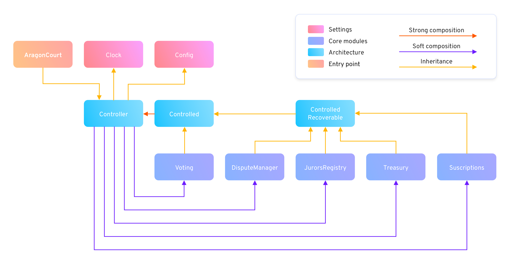

# 2. Architecture

## 2.1. Controller

The `Controller` has four main responsibilities:
- Permissions management
- Modules management
- Court terms ("clock") management
- Court configuration management

The Court protocol relies on five main modules: `DisputeManager`, `Voting`, `JurorsRegistry`, `Treasury`, and `Subscriptions`.
Each of these modules are only referenced by the `Controller`; centralizing them allows us to be able to plug or unplug modules easily.

The Court terms management and reference is held in `Clock`. Almost every functionality of the protocol needs to ensure the current Court term is up-to-date.

Every protocol configuration variable that needs to be check-pointed based on the different terms of the Court is referenced in `Config`.
Note that this is important to be able to guarantee to our users that certain actions they committed to the Court will rely always on the same configurations of the protocol that were there at the moment said actions were requested.
On the other hand, there are some configuration variables that are related to instantaneous actions. In this case, since we don't need to ensure historic information, these are held on its corresponding module for gas-optimization reasons.

## 2.2. Modules

All the modules of the protocol can be switched by new deployed ones. This allows us to have recoverability in case there is a failure in any of the modules.
Each module has a reference to the `Controller` through `Controlled`, and `ControlledRecoverable` is a special flavor of `Controlled` to ensure complete recoverability.
Since some modules handle token assets, we need to be able to move these assets from one module to another in case they are switched.

However, these modules can be frozen at any time, once the protocol has reached a high-level of maturity full-immutability will be guaranteed.
In case further changes are required a new whole implementation of the protocol can be deployed and it will be a users decision to chose the one they want to use.

Detailed information about each module functionality is described in [section 4](../4-entry-points).

## 2.3. Permissions

The permissions layer is self-controlled in the `Controller`. This component works with three `Governor` addresses to implement that:
- Modules governor
- Config governor
- Funds governor

All the functionality described above whose access needs to be restricted relies on these addresses.
The modules governor is the only one allowed to switch modules. This address can be unset at any time to ensure no further changes on the modules can be made.
Finally the funds governor is the only one allowed to recover assets from the `ControlledRecoverable` modules. As for the modules governor, this address can be unset at any time.
The config governor is the only one allowed to change all the configuration variables of the protocol. This last one, is the only governor address that is not intended to be unset.
The protocol settings should be always able to be tweaked to ensure the proper operation of Court. To guarantee decentralized governance of these variables, the config governor is meant to be the Aragon Network.

Any other modules functionality that needs to be restricted is either relying on these governor addresses as well, or on any of the other modules.
No other external accounts apart from the `Governor` addresses belong to the protocol implementation.

As described in the [launch process](https://forum.aragon.org/t/aragon-network-launch-phases-and-target-dates/1263) of Aragon Court, the governor will be a DAO properly called Aragon Network DAO managed by ANT holders.
Initially, the Aragon Network DAO will be governed by a small council with a group trusted members from the community and will be transitioned to the ANT holders at the end of the launch process.

## 2.4. Entry point

The main entry point of the protocol is `AragonCourt`, this component inherits from `Controller`.
This allows to guarantee a single and immutable address to the users of the Court protocol. `AragonCourt` does not implement core logic, only the main entry points of the protocol where each request is forwarded to the corresponding modules of the `Controller` to be fulfilled.

Detailed information about `AragonCourt` can be found in [section 4](../4-entry-points).
