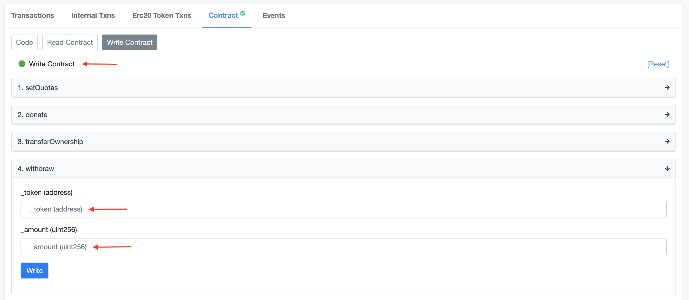
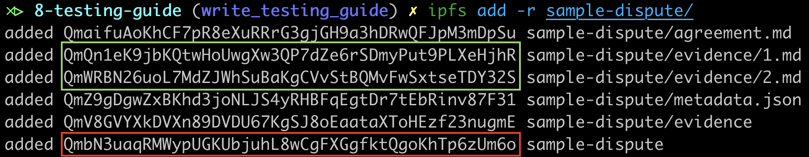

# 8. Testing guide

This guide aims to cover all the things you should know in order to try Aragon Court or integrate your application with it. 

## 8.1. Testing instances

There are a few testing instances already deployed for Aragon Court. 
All of these are mimicking the mainnet instance with some exceptions of term durations to provide a better testing experience.
Additionally, all the instances are using their own deployed version of the following ERC20 tokens:
- ANJ, the native token of Aragon Court. You will need some fake ANJ to stake as a juror to be selected to resolve disputes.  
- DAI, used for the Aragon Court fees. You will need some fake DAI to pay jurors and pay the Court subscription fees.

Of course, there is an ERC20 faucet deployed for all these instances that you can use to claim some fake ANJ or DAI to start testing. More information is outlined below on using these faucets.

### 8.1.1. Usability

This is probably the most useful testing instance you would like to try. 
Fees are low and court terms last a few minutes to make sure you can interact with it a bit faster.

- Network: Rinkeby
- Court term: 30 minutes
- Subscription fee: 10 fake DAI
- Subscription period: 1440 court terms (1 month)
- Dashboard: https://court-usability.aragon.org/
- Address: [`0x44f788370206696b20b94bc77c4f73ca264aa05e`](http://rinkeby.etherscan.io/address/0x44f788370206696b20b94bc77c4f73ca264aa05e)
- Fake ANJ: [`0xe9efff723800bb86f31db9a369e47c2bf336008e`](http://rinkeby.etherscan.io/address/0xe9efff723800bb86f31db9a369e47c2bf336008e)
- Fake DAI: [`0x55ab9b236cdc9e2cecbd41ada45d8261f8a6049b`](http://rinkeby.etherscan.io/address/0x55ab9b236cdc9e2cecbd41ada45d8261f8a6049b)
- ERC20 faucet: [`0x109dB6047d83f4dd5a8d9da3b9e9228728E3710a`](http://rinkeby.etherscan.io/address/0x109dB6047d83f4dd5a8d9da3b9e9228728E3710a)

### 8.1.2. Rinkeby

This testing instance mirrors the instance deployed to Mainnet, same terms duration and fee amounts

- Network: Rinkeby
- Court term: 8 hours
- Subscription fee: 7500 fake DAI
- Subscription period: 90 court terms (1 month)
- Dashboard: https://court-rinkeby.aragon.org/
- Address: [`0xb5ffbe75fa785725eea5f931b64fc04e516c9c5d`](http://rinkeby.etherscan.io/address/0xb5ffbe75fa785725eea5f931b64fc04e516c9c5d)
- Fake ANJ: [`0x975ef6b5fde81c24c4ec605091f2e945872b6036`](http://rinkeby.etherscan.io/address/0x975ef6b5fde81c24c4ec605091f2e945872b6036)
- Fake DAI: [`0xe9a083d88eed757b1d633321ce0519f432c6284d`](http://rinkeby.etherscan.io/address/0xe9a083d88eed757b1d633321ce0519f432c6284d)
- ERC20 faucet: [`0x3b86Fd8C30445Ddcbed79CE7eB052fe935D34Fd2`](http://rinkeby.etherscan.io/address/0x3b86Fd8C30445Ddcbed79CE7eB052fe935D34Fd2)

### 8.1.3. Ropsten

This testing instance basically mimics the Mainnet instance with lower subscription fees but same terms duration

- Network: Ropsten
- Court term: 8 hours
- Subscription fee: 10 fake DAI
- Subscription period: 90 court terms (1 month)
- Dashboard: https://court-ropsten.aragon.org/
- Address: [`0x3b26bc496aebaed5b3e0e81cde6b582cde71396e`](http://ropsten.etherscan.io/address/0x3b26bc496aebaed5b3e0e81cde6b582cde71396e)
- Fake ANJ: [`0xc863e1ccc047beff17022f4229dbe6321a6bce65`](http://ropsten.etherscan.io/address/0xc863e1ccc047beff17022f4229dbe6321a6bce65)
- Fake DAI: [`0x4e1f48db14d7e1ada090c42ffe15ff3024eec8bf`](http://ropsten.etherscan.io/address/0x4e1f48db14d7e1ada090c42ffe15ff3024eec8bf)
- ERC20 faucet: [`0x83c1ECDC6fAAb783d9e3ac2C714C0eEce3349638`](http://ropsten.etherscan.io/address/0x83c1ECDC6fAAb783d9e3ac2C714C0eEce3349638)

### 8.1.4. Local

> Unless you are familiar with using a local Aragon development environment, we recommend skipping ahead to Section 8.2 and using one of the other available testing instances (Usability/ Rinkeby/ Ropsten).

To deploy a local instance of Aragon Court you will need to clone the deployment scripts first:
 
```bash
git clone https://github.com/aragon/aragon-network-deploy/
cd aragon-network-deploy
npm i 
```

Once you have done that, make sure you have a local Ganache running:

```bash
npx ganache-cli -i 15 --port 8545 --gasLimit 8000000 --deterministic
```

Then, open a separate terminal in the same directory of the scripts repo and deploy a local instance by running the following command:

```bash
npm run deploy:court:rpc
```

This command will output the addresses of all the deployed modules of Aragon Court including the main entry point (the `AragonCourt` contract).
Additionally, it should deploy a fake version of the ANJ and DAI tokens usable for testing purposes as explained above.

## 8.2. Claiming fake tokens from the ERC20 faucets

You can claim ANJ or DAI fake tokens from the ERC20 faucets.
You can do this directly through Etherscan, simply click in any of the faucet links shared above in section 8.1.
Once there, you just need to enable your Web3 account and call the `withdraw()` function providing the desired token address and amount:


When claiming tokens remember to add the 18 zeroes for the decimals, for example 10 DAI should be requested as `10000000000000000000`. 
Bear in mind there is a quota set for these faucets; they will only allow you to withdraw up to 10,000 fake-DAI or 10,000 fake-ANJ every 7 days.

## 8.3. Installing the Aragon Court dev CLI tool

To interact with the deployed versions of Aragon Court, we built a node-based [CLI tool](https://github.com/aragonone/court-backend/tree/development/packages/cli) that you can use.
Currently, there is no published version of it. But you can clone the GitHub repo and run it locally.
To continue with the testing guide you will need to use it. First, make sure you clone it and install its dependencies as follows:
```
git clone https://github.com/aragonone/court-backend/
cd court-backend
git checkout master
npm i
npx lerna bootstrap
cd packages/cli
```

This CLI tool is built on top of Truffle using a custom [config file](https://www.npmjs.com/package/@aragon/truffle-config-v5) provided by Aragon.
Please review that package's documentation to understand how to set up your private keys for testing.

Let's continue with the Aragon Court testing guide and see how we can use the CLI tool.

## 8.4. Becoming a juror

To become a juror you simply need to activate some ANJ tokens into Aragon Court.
First make sure to have claimed some fake ANJ tokens from the faucet corresponding to the Aragon Court instance you're willing to try.
For now, the testing instances require a minimum of 10,000 ANJ so make sure to have at least that amount. 
Then, you can activate tokens into Aragon Court using the `stake` and `activate` commands of the CLI tool as follows:

```bash
node ./bin/index.js stake --juror [JUROR] --amount [AMOUNT] --from [FROM] --network [NETWORK] --verbose
node ./bin/index.js activate --juror [JUROR] --amount [AMOUNT] --from [FROM] --network [NETWORK] --verbose
```

Where:
- `[JUROR]`: address of the juror you will activate the tokens for
- `[AMOUNT]`: amount of fake ANJ tokens you will activate for the specified juror (it doesn't require adding the decimals, so to activate 10,000 ANJ simply enter `10000`)
- `[FROM]`: address paying for the fake ANJ tokens; this must be the address you used to claim the tokens from the faucet
- `[NETWORK]`: name of the Aragon Court instance you are willing to use: `usability`, `rinkeby`, or `ropsten` 

Note that you can also avoid the flag `--verbose` if you want to avoid having too much details about the transactions being sent to the network.

You can check your current stake as a juror in the dashboards linked above in section 8.1.

## 8.5. Creating a dispute

As you may know, disputes can only be submitted to Aragon Court through smart contracts that implement a specific interface to support being ruled by the court itself.
This is specified by the [`IArbitrable`](../../contracts/arbitration/IArbitrable.sol) interface.

Thus, the first thing we should do is to deploy an Arbitrable contract. You can do this from the CLI running the following command:

```bash
node ./bin/index.js arbitrable -f [FROM] -n [NETWORK] --verbose
```

Where:
- `[FROM]`: address deploying the Arbitrable contract; this address will be the one available to create disputes with it
- `[NETWORK]`: name of the Aragon Court instance you are using: `usability`, `rinkeby`, or `ropsten` 

This command will output the address of your new Arbitrable contract.

The next step is to subscribe your Arbitrable instance to Aragon Court by paying the subscription fees.
Each testing instance has different subscription fees, so make sure you claim enough fake DAI from the ERC20 faucet based on the fees described in section 8.2. 
We recommend using the `usability` testing instance to have a more fluid experience, its subscription fees are 10 fake-DAI.

Once you have done that you can subscribe your Arbitrable instance running the following command:

```bash
node ./bin/index.js subscribe -a [ARBITRABLE] -f [FROM] -n [NETWORK] --verbose
``` 

Where:
- `[ARBITRABLE]`: address of the Arbitrable instance you deployed in the previous step
- `[FROM]`: address paying for the fake DAI tokens; this must be the address you used to claim the tokens from the faucet
- `[NETWORK]`: name of the Aragon Court instance you are using: `usability`, `rinkeby`, or `ropsten` 

Now, we are almost ready to create a dispute. The last step is to send some fake DAI to the Arbitrable instance so that it can pay for the court's dispute fees.
These are different from the subscription fees. The dispute fees are to pay the jurors for each dispute to be resolved.
For the testing instances, each dispute costs 30.87 fake-DAI (`30870000000000000000` with 18 decimals).
Thus, you will need to make a transfer from your account to your Arbitrable instance.
To do that you can use the Etherscan interface for the fake DAI instance linked in section 8.1.

Finally, we are ready to create your dispute running the following command:

```bash
node ./bin/index.js dispute \
  -a [ARBITRABLE] \
  -m [METADATA] \
  -e [EVIDENCE_1] [EVIDENCE_2] ... [EVIDENCE_N] \
  -s [SUBMITTER_1] [SUBMITTER_1] ... [SUBMITTER_N] \
  -c \
  -f [FROM] \
  -n [NETWORK] \
  --verbose
```

Where: 
- `[ARBITRABLE]`: address of your Arbitrable instance
- `[METADATA]`: metadata to be linked for your dispute (continue reading to have a better understanding of how to build a proper dispute metadata)
- `[EVIDENCE_N]`: reference to a human-readable evidence (continue reading to have a better understanding of how to provide a proper evidence reference) 
- `[SUBMITTER_N]`: addresses submitting each piece of evidence; this list should match the evidence list length 
- `-c` flag: optional to declare that the evidence submission period should be immediately closed. Otherwise, you will need to manually close it afterwards. 
- `[FROM]`: address owning the Arbitrable instance being called; this address must be the one you used to deploy the Arbitrable instance before
- `[NETWORK]`: name of the Aragon Court instance you are using: `usability`, `rinkeby`, or `ropsten`

This command will output the ID of the dispute you've just created.

A few things to bear in mind is that, even though the `[METADATA]` and `[EVIDENCE_N]` arguments could be any arbitrary information, in order to use the Court Dashboard to rule disputes, these should follow a specific structure.
Currently, the Court Dashboard supports reading these pieces of information from files hosted in IPFS. Thus, it expects the following formats:
- `[METADATA]`: `'{ "metadata": "[METADATA_CID]/metadata.json" }'`
- `[EVIDENCE_N]`: `ipfs:[EVIDENCE_N_CID]`

Where `METADATA_CID` is the `CID` of a dir hosted in IPFS including a file `metadata.json`, and `[EVIDENCE_N_CID]` is the `CID` of a markdown file for the evidence #N hosted in IPFS. 
Additionally, the `metadata.json` file must have the following structure:

```json
{ 
    "description": "[Your dispute description]",
    "agreementTitle": "[A title for your agreement file]",
    "agreementText": "[Path to the agreement file in the dir uploaded to IPFS]",
    "plaintiff": "[Ethereum address representing the plaintiff]",
    "defendant": "[Ethereum address representing the defendant]"
}
```

Even though `agreementTitle`, `agreementText`, `plaintiff` and `defendant` are optional values, you will have a much better experience if you provide those.

Additionally, it is recommended to upload all these pieces of information together to IPFS. For example, you can take a look at [these files](./sample-dispute) we used to create this [sample dispute](https://court-usability.aragon.org/disputes/6). 
To upload those files we simply ran the following command while having the IPFS daemon running in background:



As you can see, the `[METADATA_CID]` is the output marked in red, while the `[EVIDENCE_N_CID]`s are the ones in green.
Finally, following this example, this was the command we ran to create the dispute:

```bash
node ./bin/index.js dispute -a 0x4BaBdb3aA57B351e57A9cb0e71B1c15Ec2e5479D -m '{ "metadata": "QmbN3uaqRMWypUGKUbjuhL8wCgFXGgfktQgoKhTp6zUm6o/metadata.json" }' -e ipfs:QmQn1eK9jbKQtwHoUwgXw3QP7dZe6rSDmyPut9PLXeHjhR ipfs:QmWRBN26uoL7MdZJWhSuBaKgCVvStBQMvFwSxtseTDY32S -s 0x59d0b5475AcF30F24EcA10cb66BB5Ed75d3d9016 0x61F73dFc8561C322171c774E5BE0D9Ae21b2da42 -c -n usability --verbose
```

## 8.6. Ruling a dispute

You can use any of the Court Dashboard instances linked in section 8.1 to interact with your created disputes (note that in some environments, it may be difficult to ensure that your account is drafted due to the randomness nature of the court—and therefore can be difficult to come to a ruling you want). 
If your dispute's metadata was not correctly formatted or made available as explained in sections 8.5.1 and 8.5.2, the dispute will most likely not display the intended information to jurors.

Alternatively, you can use the rest of the CLI tool [commands](https://github.com/aragonone/court-backend/tree/master/packages/cli/#commands) to begin ruling your dispute:
- [`draft`](https://github.com/aragonone/court-backend/blob/master/packages/cli/src/commands/draft.js): Draft dispute and close evidence submission period if necessary
- [`commit`](https://github.com/aragonone/court-backend/blob/master/packages/cli/src/commands/commit.js): Commit vote for a dispute round
- [`reveal`](https://github.com/aragonone/court-backend/blob/master/packages/cli/src/commands/reveal.js): Reveal committed vote
- [`appeal`](https://github.com/aragonone/court-backend/blob/master/packages/cli/src/commands/appeal.js): Appeal dispute in favour of a certain outcome
- [`confirm-appeal`](https://github.com/aragonone/court-backend/blob/master/packages/cli/src/commands/confirm-appeal.js): Confirm an existing appeal for a dispute
- [`execute`](https://github.com/aragonone/court-backend/blob/master/packages/cli/src/commands/execute.js): Execute ruling for a dispute
